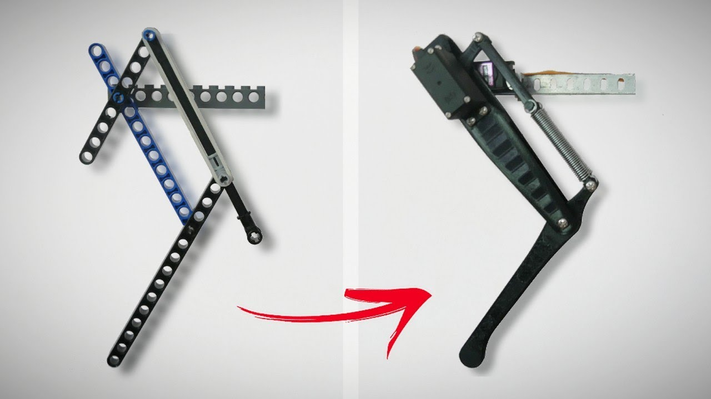

### Quadrumini Journal started for [Highway to Undercity](https://highway.hackclub.com/)
total hours worked: `6`

# `6/3/2025` - Research on Electronics Design (1 hr)
I did some calculations for the power source I need in order to power my quadruped, and I have come up with two options:
- Stay with 8 motors and have 4 DOF
- Upgrade to 12 motors and have all 6 DOF
I think I will be ambitious, and go for the 12 motors to have all 6 DOF, but the power consuption will be really high 👀

Also did research on motors, and I will be sticking with the MG90! I want to keep my robot affordable 🥳

# `6/4/2025` - Research on General Design (1.5 hrs)
Today, I did some research on different types of legs, and since one of my goals is to have my robot jump I was thinking of using a compliant leg. I looked into many designs and if I do end up going for a compliant leg I will most likely be going with this one! I like it's simplicity.

 

[Design by Adam Beedle](https://www.youtube.com/watch?v=bDxItdyQ3jc)

On Saturday, I hope to start working on my first CAD and print out a couple iterations :)

# `6/10/2025` - More Research & CAD (3.5 hrs)
I looked into which MCUs to use and came to the conclusion that the Raspberry Pi Pico would be the best option for me, coupled with a PCA9685 Servo Driver. It is able to give me the power I need to move all 12 servos at once and keep it cost efficient :) It's power will be a massive upgrade from the Arduino Nano I have been testing with.

  
I also started cading the leg for the robot, and got some progress. A lil rusty with Fusion 360 so it took me longer than I would like to admit (which is why I spent so much time here) but I got the CAD done and learned how to put articulate joints on! Each leg has 3 DOF!
  
 
  
Because there is now 3 DOF per leg, I have decided to not design a compliant leg. I may design one in the future but I have decided to go for more degrees of freedom 🕺 over jumping ⬆️ for now.

# `6/14/2025` - Title (4 hrs)
Today, I got a lot done! I remade the CAD for the hip flexor to shed some weight and also make it easier to use, and started working on the PCB for the robot, which I intend to use to drive the entire thing off of!
 
Hip Flexor Redesign:
  
 
  
The last design was very boxy, and took up a lot of space laterally, which was limited. With this redesign, I moved it's bracing to be vertical and made it overall thinner! It is also now way easier to put in the servo horn :)
 
Current PCB Schematic:
  
 
  
I am using the Raspberry Pi Pico as my MCU (Microcontroller Unit) and will be using the PCA9685 chip to drive everything, which makes it so that I can drive all of the servos through one I2C connection! I decided to put everything on a PCB, as I wanted to minimize the amount of wires as much as possible. This design option will give me more space in the housing to cram the servo wires in, and put my MPU chip in a more precise spot! (will be implementing that very soon)

# `4/15/2025` - Title (5 hrs)
Spent a lot of time today on CAD, went through multiple iterations of design for the housing. Unfortunately I forgot to take progress pictures, but this is what I finally came up with:
  
 
  
I felt the design was nice, but I realized that because of the way my leg is designed the front legs are unable to bend fully (as seen in the picture above)
 
So anyway, heres what needs to be done left:
- finalize PCB + circuit
- re-design housing (?)

Hopefully I will be able to get it done soon!

# `4/20/2025 - 4/25/2025` - Finalized Design (12 hrs)
I haven't been journaling consistently due to summer classes kicking up (oops) but I have been working here and there over the past week. Lots of progress! Here is the finished schematic of the PCB + 3D render!
  
 
 
 
  
For the actual connections, the way it will work is I will have a 2S Lipo battery connected to a UBEC (Universial Battery Eliminator Circuit) which will then feed into the PCB. The motors then get connected to the PCB to be controlled :)
Basically, it goes `2S Lipo` -> `UBEC` -> `PCB` -> `Servos`
 
For more accurate control, I also added in a MPU module that can be stuck on the bottom of the PCB! This concludes the design part of the journal, and hopefully the next portion will be me building it out :)
# `0/0/2025` - Title (_ hrs)
